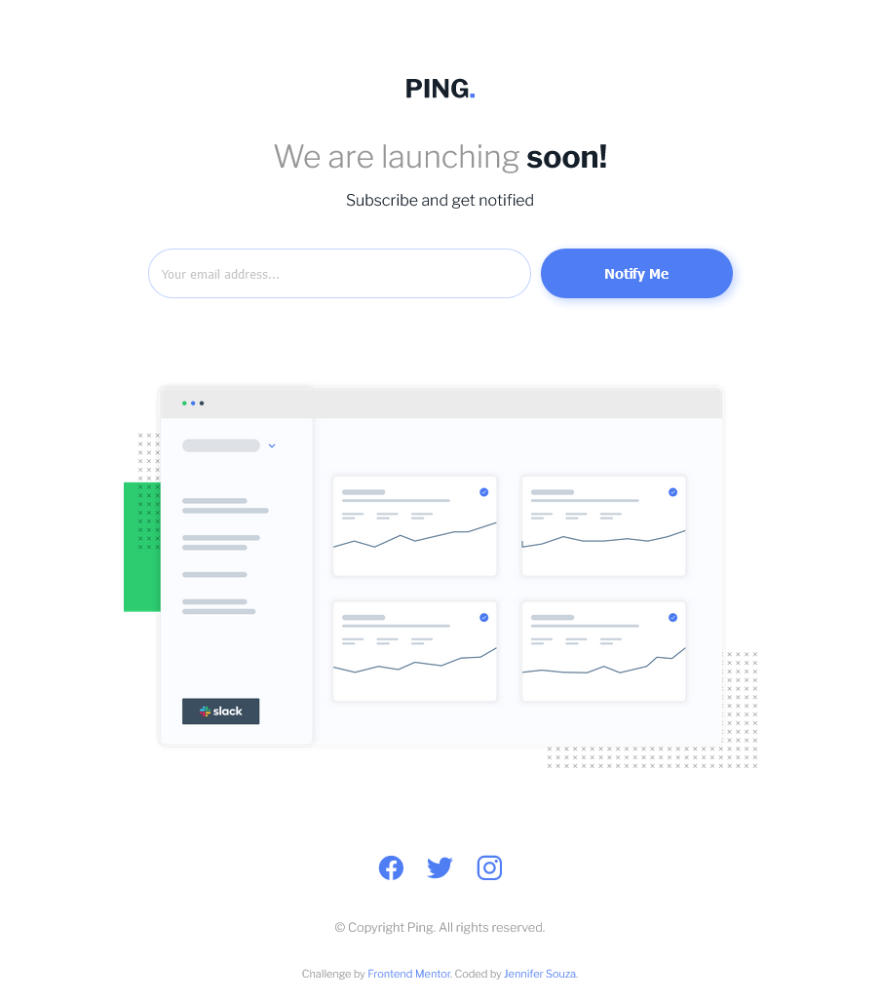

# Frontend Mentor - Ping coming soon page solution

This is a solution to the [Ping coming soon page challenge on Frontend Mentor](https://www.frontendmentor.io/challenges/ping-single-column-coming-soon-page-5cadd051fec04111f7b848da). Frontend Mentor challenges help you improve your coding skills by building realistic projects. 

## Table of contents

- [Overview](#overview)
  - [The challenge](#the-challenge)
  - [Screenshot](#screenshot)
  - [Links](#links)
- [My process](#my-process)
  - [Built with](#built-with)
  - [What I learned](#what-i-learned)
  - [Continued development](#continued-development)
  - [Useful resources](#useful-resources)
- [Author](#author)

## Overview

### The challenge

Users should be able to:

- View the optimal layout for the site depending on their device's screen size
- See hover states for all interactive elements on the page
- Submit their email address using an `input` field
- Receive an error message when the `form` is submitted if:
	- The `input` field is empty. The message for this error should say *"Whoops! It looks like you forgot to add your email"*
	- The email address is not formatted correctly (i.e. a correct email address should have this structure: `name@host.tld`). The message for this error should say *"Please provide a valid email address"*

### Screenshot

### Links

- Solution URL: [https://single-column-coming-soon-page-one.vercel.app/](https://single-column-coming-soon-page-one.vercel.app/)
- Live Site URL: [https://github.com/zoedarkweather/single-column-coming-soon-page](https://github.com/zoedarkweather/single-column-coming-soon-page)

## My process

### Built with

- Semantic HTML5 markup
- CSS custom properties
- CSS Grid
- Mobile-first workflow
- JavaScript

### What I learned
This was a great opportunity to practice what I have been learning in the Webforms module of the MDN developer coursework. I learned how to stop the default validation behvior and apply custom error messages, using the novalidate attribute, and how to prevent the form from submitting using preventDefault(). I also learned that putting "aria-live = 'polite'" on custom error messages ensures the messages will be read to screenreader users.

9/28 Updates: Improved accessibility by adding Aria labels to the social media links, Aria-required attribute to the email input, and changing the error message to "Assertive" as I've since learned that this is actually the correct labeling for error messages. I also tested it with NVDA. I have issues with the accessibility of the design - color contrast is not great, and the lack of a label for the email is maybe not great for all users. I hid a label to be read by screenreaders but that only helps screenreader users.

Other updates included minor tweaks to sizing and spacing to better match the design.

### Continued development
Keep practicing with CSS and JavaScript. I also am very interested in doing more of a deep dive into accessibility issues and learning as much as I can about how to improve in that area.

### Useful resources

- [MDN - Client Side Form Validation](https://developer.mozilla.org/en-US/docs/Learn/Forms/Form_validation) - This helped me with the code form validation code, especially with how to stop the default behavior.

- [5-ways-to-make-labels-accessible-for-input-controls](https://medium.com/codex/5-ways-to-make-labels-accessible-for-input-controls-and-3-ways-not-to-55ecb2a2e80a) - This article had some good suggestions on how to add a label to a form that would not be shown visually, but would still be read out by a screereader.

## Author

- Github - [Jennifer Souza](https://github.com/zoedarkweather)
- Frontend Mentor - [@zoedarkweather](https://www.frontendmentor.io/profile/zoedarkweather)

