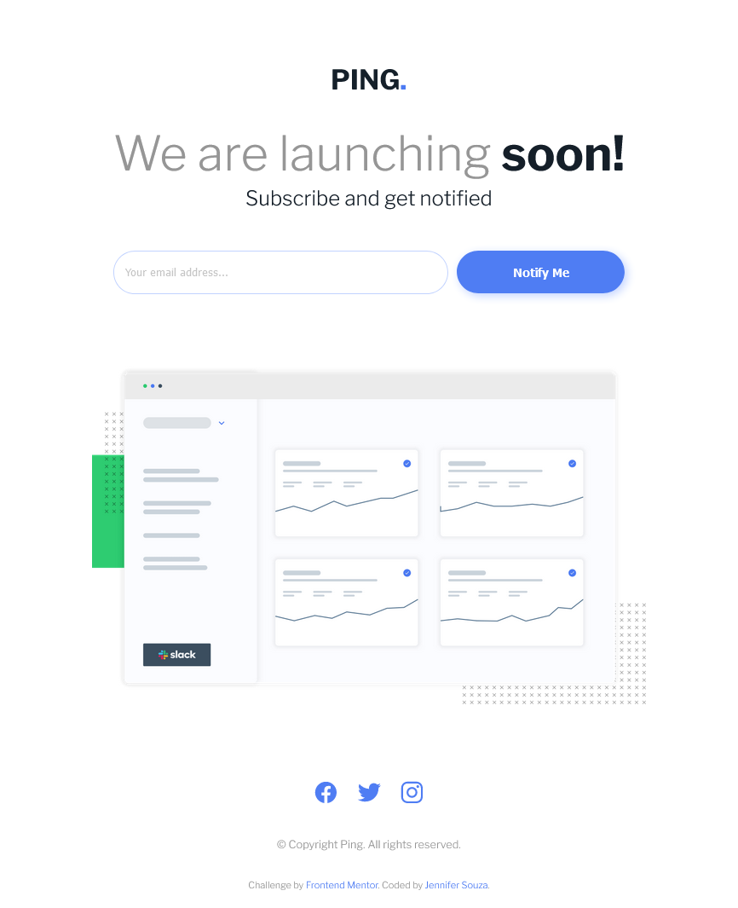

# Frontend Mentor - Ping coming soon page solution

This is a solution to the [Ping coming soon page challenge on Frontend Mentor](https://www.frontendmentor.io/challenges/ping-single-column-coming-soon-page-5cadd051fec04111f7b848da). Frontend Mentor challenges help you improve your coding skills by building realistic projects. 

## Table of contents

- [Overview](#overview)
  - [The challenge](#the-challenge)
  - [Screenshot](#screenshot)
  - [Links](#links)
- [My process](#my-process)
  - [Built with](#built-with)
  - [What I learned](#what-i-learned)
  - [Continued development](#continued-development)
  - [Useful resources](#useful-resources)
- [Author](#author)

## Overview

### The challenge

Users should be able to:

- View the optimal layout for the site depending on their device's screen size
- See hover states for all interactive elements on the page
- Submit their email address using an `input` field
- Receive an error message when the `form` is submitted if:
	- The `input` field is empty. The message for this error should say *"Whoops! It looks like you forgot to add your email"*
	- The email address is not formatted correctly (i.e. a correct email address should have this structure: `name@host.tld`). The message for this error should say *"Please provide a valid email address"*

### Screenshot

### Links

- Solution URL: [Add solution URL here](https://your-solution-url.com)
- Live Site URL: [Add live site URL here](https://your-live-site-url.com)

## My process

### Built with

- Semantic HTML5 markup
- CSS custom properties
- CSS Grid
- Mobile-first workflow
- JavaScript

### What I learned
This was a great opportunity to practiced what I have been learning in the Webforms module of the MDN developer coursework. I learned how to stop the default validation behvior and apply custom error messages, using the novalidate attribute, and how to prevent the form from submitting using preventDefault(). I also learned that putting a "aria-live = 'polite'" on custom error messages ensures the messages will be read to screenreader users.

### Continued development
Keep practicing with CSS and JavaScript. I also am very interested in doing more of a deep dive into accessibility issues and learning as much as I can about how to improve in that area.

### Useful resources

- [MDN - Client Side Form Validation](https://developer.mozilla.org/en-US/docs/Learn/Forms/Form_validation) - This helped me with the code form validation code, especially with how to stop the default behavior.

## Author

- Github - [Jennifer Souza](https://github.com/zoedarkweather)
- Frontend Mentor - [@zoedarkweather](https://www.frontendmentor.io/profile/zoedarkweather)

